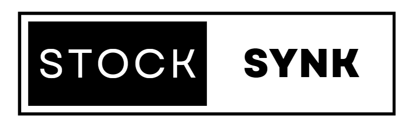

## Présentation du projet

Ce projet est une plateforme de gestion de stocks destiner au commerciants

## Les langages utilisés :
* [![PHP][PHP]][PHP-url]
* [![HTML][HTML]][HTML-url]
* [![CSS][CSS]][CSS-url]
* [![Bootstrap][Bootstrap]][Bootstrap-url]
* [![JQuery][JQuery]][JQuery-url]
* [![MySQL][MySQL]][MySQL-url]

## Fonctionnalités Implémentées

### Gestion du catalogue et des QrCode :
- Gestion du catalogues par les salariers et administrateur
- Gestion des qrcode par les salariés et administrateur

### Vente :
- Vente de produit du catalogues avec mise à jour des stocks
- Visualisation des vente par les comptes administrations

### Magasin
- Création de plusieur magasin avec leur propre stock
- Affectation de magasin à plusieur salarie

## Roadmap
- [x] Gestion des comptes utilisateurs
- [x] Gestion des QRCode et du nombre de scans
- [x] Gestion de l'inventaire et suivi des stocks
- [ ] Gestion des factures
- [ ] Prévision du renouvellement des stocks
- [ ] Ajout de la date de validité pour les comptes salariés
- [ ] Amélioration de l'interface utilisateur pour une expérience plus engageante et intuitive.
- [ ] Journalisation des modifications effectuées
- [ ] Conservation des coordonnées des fournisseurs
- [ ] Historique d'achat des clients
- [ ] Catégorisation des produits

## Licence

Distribué sous licence MIT. Assurez-vous d'ajouter l'attribution au projet en incluant le droit d'auteur dans votre documentation ou interface utilisateur. Consultez le fichier [`LICENCE.txt`](LICENCE.txt) pour plus d'informations.

<!-- MARKDOWN LINKS & IMAGES -->
[Bootstrap.com]: https://img.shields.io/badge/Bootstrap-7952B3?style=flat&logo=Bootstrap&logoColor=white
[JQuery.com]: https://img.shields.io/badge/jQuery-0769AD?style=flat&logo=jQuery&logoColor=white
[PHP]: https://img.shields.io/badge/PHP-777BB4?style=flat&logo=PHP&logoColor=white
[HTML]: https://img.shields.io/badge/HTML-E34F26?style=flat&logo=HTML5&logoColor=white
[CSS]: https://img.shields.io/badge/CSS-1572B6?style=flat&logo=CSS3&logoColor=white
[MySQL]: https://img.shields.io/badge/MySQL-4479A1?style=flat&logo=MySQL&logoColor=white

[Bootstrap-url]: https://getbootstrap.com/
[JQuery-url]: https://jquery.com/
[PHP-url]: https://www.php.net/
[HTML-url]: https://developer.mozilla.org/en-US/docs/Web/HTML
[CSS-url]: https://developer.mozilla.org/en-US/docs/Web/CSS
[MySQL-url]: https://www.mysql.com/